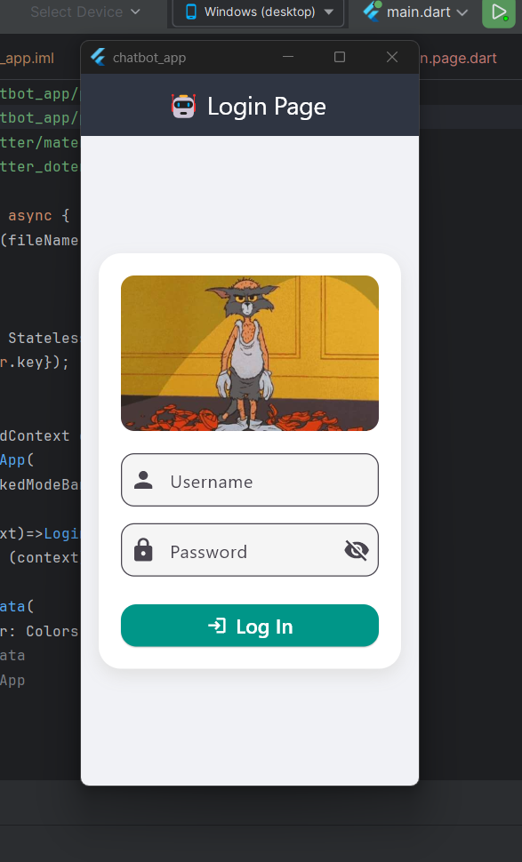
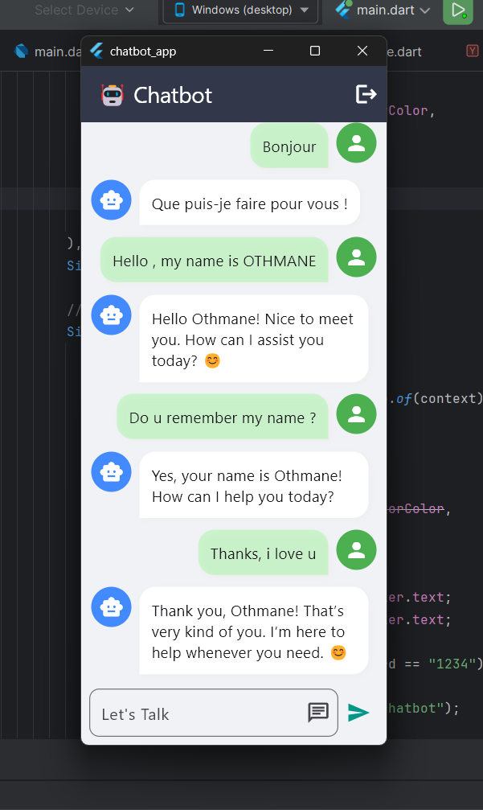

# 🤖 ChatBot Flutter App

A simple Flutter application that provides a login screen and a chatbot interface using OpenAI's API. The app demonstrates Flutter UI components, API integration, and navigation.

---

## 🖼️ Screenshots

| Login Page                                  | Chatbot Page                                 |
|---------------------------------------------|----------------------------------------------|
|  |  |

---

## 📱 Features

- 🔐 **Login Page** with username & password validation.
- 💬 **Chatbot Screen** powered by OpenAI's GPT.
- 🎨 Clean UI with modern design and icons.
- 🚀 Navigation between pages using Flutter routing.
- 🔑 API Key integration (to be added by user).


---

## 🧠 Technologies

- ✅ Flutter 3.x
- ✅ Dart
- ✅ OpenAI GPT API
- ✅ Ollama
- ✅ Material Design

---

# 📁 Project Structure

```bash
lib/
├── main.dart             # Main app file with routes
├── login_page.dart       # Login UI & logic
├── chatbot_page.dart     # Chat UI and OpenAI logic
└── images/
    └── tomAngry.jpg      # Image used in login screen
```
---
🛠️ Setup Instructions

## Environment Configuration (.env)

Before running the project, make sure to create a `.env` file at the root of the project.
This file should contain your OpenAI API key as follows:
OPENAI_API_KEY=your_api_key_here

```
git clone https://github.com/OTH-BD/chatbot-app-flutter.git
cd chatbot-app-flutter

```env
OPENAI_API_KEY=sk-xxxxxxxxxxxxxxxxxxxxxxxxxxxxxxxxxxxxxxxx

flutter pub get

flutter run

```
---

🔐 Login Credentials (for demo)
```
Username: admin
Password: 1234
```
